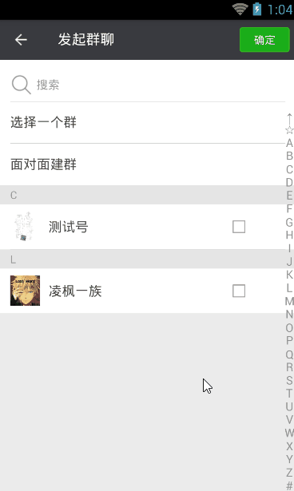
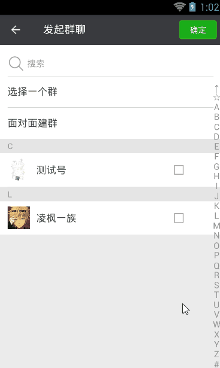
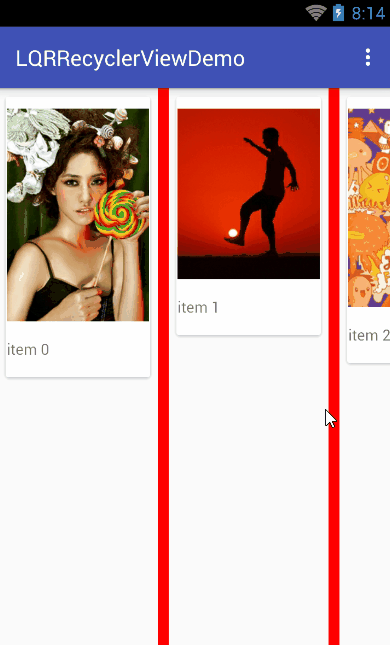

# LQRRecyclerViewLibrary
对RecyclerView的封装，让其使用更加简单，得心应手

##***LQRRecyclerView***
该控件是对RecyclerView的封装，众所周知，RecyclerView功能十分强大，一个控件只需要给它设置不同的LayoutManager就可以实现ListView、GridView和瀑布流，实际项目开发每次使用都要创建并设置LayoutManager,略显“麻烦”；除此之外，最让人无语的就是分割线的绘制，相信不少人会为其头痛吧。故本控件针对上述两个问题对RecyclerView进行了优化，每个的设置只需要一句代码搞定。
如：

    <com.lqr.recyclerview.LQRRecyclerView
        android:id="@+id/rv"
        android:layout_width="match_parent"
        android:layout_height="match_parent"
        app:rv_divider_color="#f00"				//设置纯色分割线颜色（还可以设置图片分割线）
        app:rv_divider_size="10dp"				//设置分割线大小
        app:rv_orientation="vertical"			//设置列表控件的方向
        app:rv_default_animator_open="true"		//设置是否开启局部刷新动画（不设置默认关闭）
        app:rv_type="grid"/>					//设置列表类型（列表/网格、瀑布流）

###**1、导入**

	compile 'com.lqr.recyclerview:library:1.0.2'

###**2、设置LQRRecyclerView的控件类型**

*LinearLayoutManager能做到的，GridLayoutManager也能做到，所以本工程去掉了"list"这一项

	①xml方式（有三种选择：grid、stagger）
	app:rv_type="" 

	②代码方式(有三种选择：TYPE_GRID、TYPE_STAGGER)
	mRv.setType(LQRRecyclerView.TYPE_XX);

###**3、设置LQRRecyclerView的控件方向**

	①xml方式（有两种选择：vertical、horizontal）
	app:rv_orientation="" 

	②代码方式(有两种选择：ORIENTATION_VERTICAL、ORIENTATION_HORIZONTAL)
	mRv.setOrientation(LQRRecyclerView.XX);

###**4、设置LQRRecyclerView的列数**

	①xml方式
	app:rv_column="2"

	②代码方式
	mRv.setColumn(2);

###**5、设置LQRRecyclerView的分割线样式**

####1)设置纯色分割线

	①xml方式
	app:rv_divider_color="#f00"
    app:rv_divider_size="10dp" 

	②代码方式
	mRv.setDividerColor();
    mRv.setDividerSize();

####2)设置图片分割线
	
	①xml方式
	app:rv_divider_drawable="@mipmap/ic_launcher"
    app:rv_divider_size="10dp" 

	②代码方式
    mRv.setDividerDrawable();
    mRv.setDividerSize();

###**6、设置默认局部刷新动画的开启和关闭**
*因为开发时很多时候是不需要默认的条目动画的，所以默认设置为不要动画（即为false），注意，如果你的项目中用到了自定义条目动画，那么要将该属性打开！！！

	①xml方式
    app:rv_default_animator_open="true"

	②代码方式
    //打开默认局部刷新动画
    mRv.openDefaultAnimator();
    //关闭默认局部刷新动画
    mRv.loseDefaultAnimator();

下面分别是app:rv_default_animator_open="true"和"false"的效果演示

###**7、滑动指定位置**
*使用RecyclerView自带的smoothScrollToPosition方法和scrollToPosition方法实现滑动到指定位置时，不会将对应的条目置顶，使用以下方法可解决上述问题。

滚动：

	mRv.moveToPosition(position);

平滑滚动：

	mRv.smoothMoveToPosition(position);

###**8、监听LQRRecyclerView的滚动**
因为该控件已经对RecyclerView进行过监听，用于实现平滑滚动条目置顶，故要监听其滚动事件，需要使用以下接口：OnScrollListenerExtension

	mRv.setOnScrollListenerExtension(new OnScrollListenerExtension...);

上述功能可参考项目**LqrRecyclerViewDemo**

效果如下：

